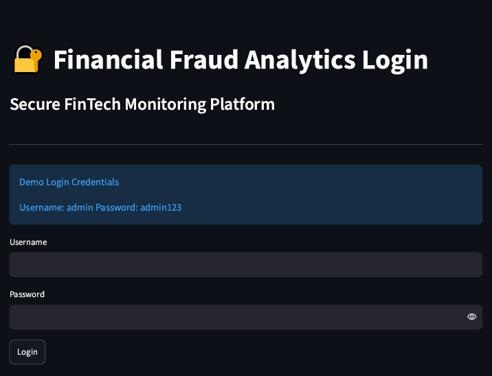
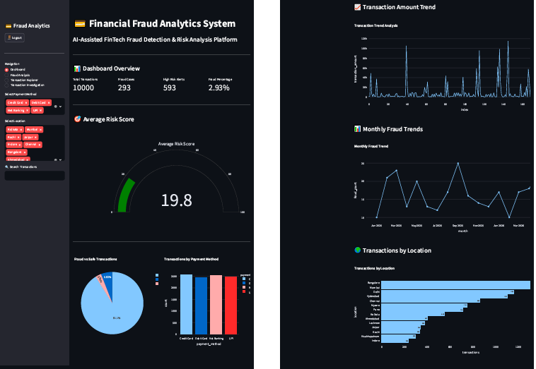
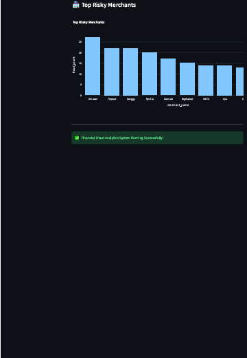
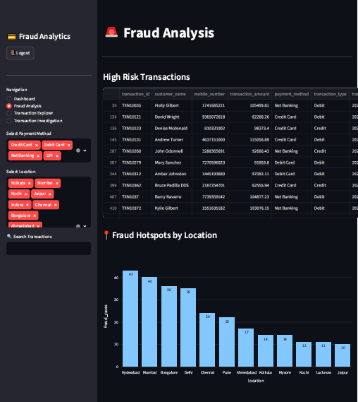
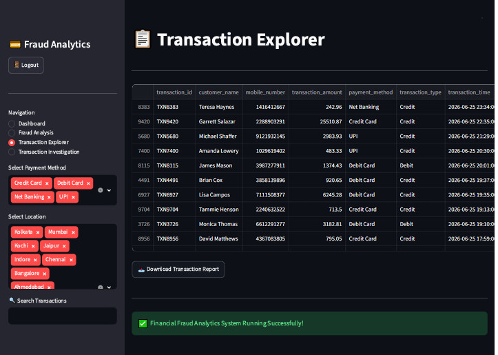
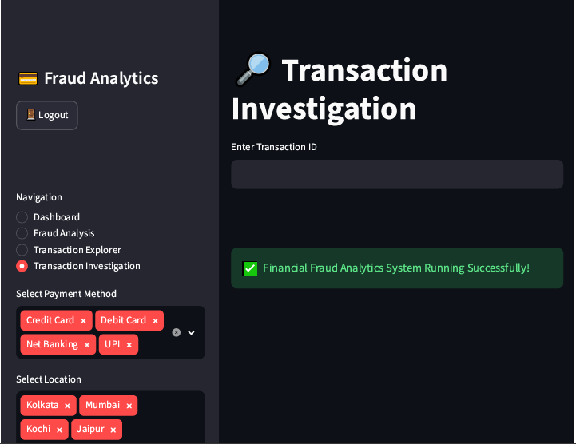

# 💳 Financial Fraud Analytics System


## 📖 Overview

The **Financial Fraud Analytics System** is a web-based analytics application built using **Python** and **Streamlit** to identify potentially fraudulent financial transactions through a rule-based risk scoring engine.

The application processes transaction data, assigns risk scores based on predefined business rules, classifies transactions into **Safe**, **High Risk**, and **Fraud**, and presents interactive dashboards for monitoring, investigation, and business reporting.

---

## 🎯 Objectives

- Detect potentially fraudulent financial transactions using rule-based analytics.
- Calculate transaction risk scores based on predefined business rules.
- Visualize fraud trends through interactive dashboards.
- Enable efficient transaction investigation using search and filtering.
- Demonstrate practical data analytics and dashboard development using Python.

---

## 🛠 Tech Stack

- **Python**
- **Streamlit**
- **Pandas**
- **Plotly**
- **MySQL**
- **Faker**
- **Git & GitHub**
- **Streamlit Community Cloud**

---

## 🌐 Live Demo

**Try the application here:**

🔗 https://financial-fraud-analytics.streamlit.app/

---

## 📂 Repository Structure

```text
Financial-Fraud-Analytics-System/
│
├── .devcontainer/
│   └── devcontainer.json
│
├── images/
│   ├── dashboard-overview-1.png
│   ├── dashboard-overview-2.png
│   ├── fraud-analysis.png
│   ├── login-page.png
│   ├── transaction-explorer.png
│   └── transaction-investigation.png
│
├── app.py
├── generate_data.py
├── requirements.txt
├── transactions.csv
└── README.md
```

---

## 💡 Skills Demonstrated

- Rule-Based Fraud Detection
- Risk Score Calculation
- Data Analysis using Pandas
- Interactive Dashboard Development
- Business Intelligence Visualization
- Data Filtering & Search
- Streamlit Web Application Development
- Cloud Deployment

---

# 📸 Application Walkthrough

## Login

Secure login interface for accessing the analytics dashboard.



---

## Dashboard

Provides a consolidated overview of transaction statistics, fraud metrics, risk distribution, and business KPIs.





---

## Fraud Analysis

Displays high-risk transactions, fraud distribution, and location-based fraud insights.



---

## Transaction Explorer

Allows users to search, filter, and export transaction records for further analysis.



---

## Transaction Investigation

Enables detailed investigation of individual transactions using Transaction ID search.



---

## 🧠 Fraud Detection Logic

Each transaction is evaluated using predefined business rules to calculate a cumulative **Risk Score**.

| Rule | Risk Score |
|------|-----------:|
| Transaction Amount > ₹80,000 | +50 |
| Credit Card Transaction > ₹50,000 | +30 |
| Web Transaction | +20 |
| Transaction Outside Trusted Locations | +10 |
| Late-Night Transaction (1 AM – 4 AM) | +20 |

### Risk Classification

| Risk Score | Status |
|------------|--------|
| 0 – 39 | ✅ Safe |
| 40 – 59 | ⚠️ High Risk |
| 60+ | 🚨 Fraud |

---

## 📈 Key Features

- Secure login authentication.
- Rule-based fraud detection engine.
- Automated transaction risk scoring.
- Interactive fraud analytics dashboard.
- Monthly fraud trend visualization.
- Risky merchant analysis.
- Location-wise transaction insights.
- Searchable transaction explorer.
- Transaction investigation by Transaction ID.
- CSV report download functionality.

---

## 🚀 Technical Highlights

- Developed a rule-based fraud detection engine using configurable business rules.
- Built an interactive analytics dashboard with Streamlit and Plotly.
- Processed and analyzed financial transaction data using Pandas.
- Implemented transaction search, filtering, and CSV export functionality.
- Visualized fraud trends, merchant risk, and geographic transaction distribution.
- Generated synthetic transaction data using Faker for testing and analysis.
- Deployed the application using Streamlit Community Cloud.

---

## ▶️ Run Locally

### Clone the repository

```bash
git clone https://github.com/ramya-r25/financial-fraud-analytics-system.git
```

### Navigate to the project directory

```bash
cd financial-fraud-analytics-system
```

### Install dependencies

```bash
pip install -r requirements.txt
```

### Run the application

```bash
streamlit run app.py
```
